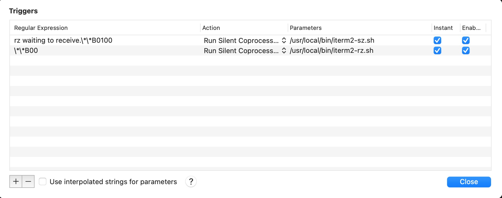

# iTerm2-zmodem scripts

[中文文档](https://www.xiebruce.top/1863.html)  
[详细文档](https://www.xiebruce.top/1863.html)

These two shells are work with iTerm2 and rz/sz to allow it upload files to server.

## Config steps

- 1.install `lrzsz` on your server

  ```
  # Debian
  apt install lrzsz

  # redhat/centos7
  yum install lrzsz

  # centos8
  dnf install lrzsz
  ```

- 2.install `lrzsz` on your macOS
  ```
  brew install lrzsz
  ```
- 3.download these two scripts to `/usr/local/bin/`

  ```bash
  wget https://raw.githubusercontent.com/xiebruce/iterm2-zmodem/main/iterm2-rz.sh -O /usr/local/bin/iterm2-rz.sh

  wget https://raw.githubusercontent.com/xiebruce/iterm2-zmodem/main/iterm2-sz.sh -O /usr/local/bin/iterm2-sz.sh
  ```

- 4.give executable permission to these two files
  ```bash
  chmod u+x /usr/local/bin/iterm2-*
  ```
- 5.iTerm2→Preferences→Profiles→Default(or other profile)→Advanced→Triggers→Edit, add two triggers as the screenshot
  
  | Regular Expression | Action | Parameters | Instant | Enabled |
  | --------------------------------- | ----------------------- | --------------------------- | :------ | :------ |
  | \\*\\*B00 | Run Silent Coprocess... | /usr/local/bin/iterm2-rz.sh | check | check |
  | rz waiting to receive.\\*\\*B0100 | Run Silent Coprocess... | /usr/local/bin/iterm2-sz.sh | check | check |

## Usage

Fist login to your server

```bash
ssh user@12.34.56.78
```

**Upload files**: on server, type `rz`, press Enter, wait for a while, choose files you want to upload.

**Download files**: on server, type `sz /path/to/file`, press Enter, wait for a while, the file will be downloaded to your macOS "Downloads" folder.

```bash
# send multi files to you macOS(you can think of it as download file from server)
sz /path/to/file1 /path/to/file2 "/path/to/file name have space"

# send all files under the folder to your macOS
sz /path/to/folder/*
```

If you want to choose which folder you want to save to, you can add the following environment variable to `~/.bashrc`

```bash
export CHOOSE_FOLDER=true
```

Note that no matter you are using zsh or fish or other shell, you should add it to `~/.bashrc`, otherwise it will not work.

For more details, see [here](https://www.xiebruce.top/1863.html).
